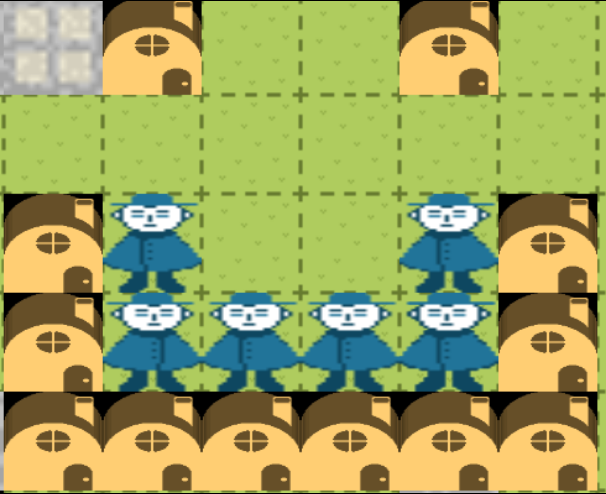

<p align="center">
  
</p>

<div align="center">

# Running Water

</div>

<div align="center">
    
    
    
</div>

A fun social multiplayer online game where you can chat with friends and earn in-game currency by building infrastructure in the digital world.

## Screenshot


## Gameplay
The objective of Town is to build a thriving digital metropolis. You can collaborate with other players, chat with friends, and design and construct various types of infrastructure, like roads and houses. By contributing to the town, you'll earn in-game currency to fund bigger and better projects.

## Features
*   **Multiplayer:** Play and interact with people from all over the world.
*   **Chat:** Communicate with other players in real-time.
*   **Building:** Create and customize your own corner of the digital world.
*   **In-Game Economy:** Earn currency by contributing to the town.

## How to Play
*   **Arrow Keys:** Move your character.
*   **Click:** Interact with the world to build.
*   **Enter:** Open the chat window.

## Hosting a Server

1.  Clone this repository.
2.  Install dependencies for the server:
    ```bash
    $ cd server && npm install
    ```
3.  Start the server:
    ```bash
    $ cd server && node app.js
    ```

## Connecting to a Server

1.  Download the latest release of the client from the [releases page](https://github.com/itsjohnward/town-mmo/releases).
2.  Open the client and connect to the server using the server's IP address.
